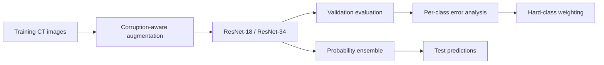

# Robust Abdominal CT Classification under Image Corruptions

A PyTorch pipeline for robust 11-class organ classification from
grayscale abdominal CT images, developed for the Robust Medical Image
Classification Challenge 2025.

The project focuses on performance under image degradation and
class-specific failure modes rather than clean-image accuracy alone.

## Highlights

- ResNet-18 and ResNet-34 adapted for single-channel CT images
- Corruption-aware augmentation with Gaussian noise, salt-and-pepper
  noise, resolution degradation, affine transformations, and random erasing
- Class-balanced sampling with validation-guided hard-class weighting
- Per-class accuracy and confusion-matrix analysis
- Probability-level ensembling across two and four independently trained models
- Reproducible generation of Kaggle-compatible predictions

## Pipeline



## Results

| Model | Validation Accuracy | Macro-F1 | Kaggle Private Score |
|---|---:|---:|---:|
| ResNet-18 v2 | ADD | ADD | ADD |
| ResNet-18 v3 | ADD | ADD | ADD |
| ResNet-34 v2 | ADD | ADD | ADD |
| ResNet-34 v3 | ADD | ADD | ADD |
| Four-model ensemble | ADD | ADD | ADD |

Only metrics reproduced from saved predictions or experiment logs are
reported.

## Dataset

The competition dataset is not distributed in this repository.

Download it from:

https://www.kaggle.com/competitions/robust-med-ct-2025/data

Expected structure:

```text
IS_2025_OrganAMNIST/
├── train/
│   ├── images_train/
│   └── labels_train.csv
├── val/
│   ├── images_val/
│   └── labels_val.csv
└── test/
    ├── images/
    └── manifest_public.csv
```

## Installation

```bash
git clone https://github.com/Mingze101/robust-medct-2025.git
cd robust-medct-2025

python -m venv .venv
pip install -r requirements.txt
```

## Usage

Train an individual model:

```bash
python scripts/train.py --model resnet18
python scripts/train.py --model resnet34
```

Evaluate checkpoints and generate per-class metrics:

```bash
python scripts/evaluate.py
python scripts/analyze_validation_errors.py
```

Generate a four-model ensemble submission:

```bash
python scripts/predict_ensemble.py \
    --checkpoints checkpoints/resnet18_v2.pth \
                  checkpoints/resnet18_v3.pth \
                  checkpoints/resnet34_v2.pth \
                  checkpoints/resnet34_v3.pth
```

## Methodological Notes

Hard-class weighting was derived from validation-set error patterns and
should therefore be interpreted as model-development feedback rather
than independent test evidence.

The repository is intended for research and benchmarking. It is not a
clinical diagnostic system.

## License

The source code is released under the MIT License. The competition
dataset and its associated terms are governed separately by the dataset
provider and Kaggle competition rules.
