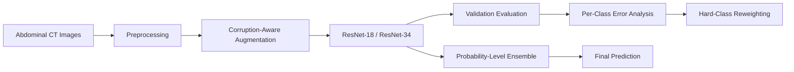

# RobustMedCT 2025: Robust Abdominal CT Classification

[](https://www.python.org/)
[](https://pytorch.org/)
[](#)
[](LICENSE)

A PyTorch pipeline for robust 11-class organ classification from grayscale abdominal CT images.

The project was developed for the [Robust Medical Image Classification Challenge 2025](https://www.kaggle.com/competitions/robust-med-ct-2025) and focuses on reliable classification under image degradation, class imbalance, and difficult inter-class boundaries.

## Highlights

* ResNet-18 and ResNet-34 adapted for single-channel CT images
* Corruption-aware augmentation for robustness under image degradation
* Class-balanced sampling with validation-guided hard-class weighting
* Per-class error analysis and confusion-matrix inspection
* Probability-level ensembling across multiple independently trained models
* Reproducible generation of Kaggle-compatible predictions

## Technical Approach

The pipeline combines model adaptation, robustness-oriented training, error-driven refinement, and model ensembling.



### 1. Single-channel model adaptation

Standard torchvision ResNet architectures are modified to accept grayscale CT images by replacing the first convolutional layer with a one-channel convolution.

The RGB pretrained weights are converted by averaging across the original input channels.

### 2. Robustness-oriented augmentation

The training pipeline includes:

* Gaussian noise
* Salt-and-pepper noise
* Resolution degradation through downsampling and upsampling
* Random affine transformations
* Random rotations
* Random erasing
* Intensity normalization

These transformations simulate image degradation and encourage the models to learn more stable anatomical representations.

### 3. Class-aware training

A `WeightedRandomSampler` is used to reduce the influence of class imbalance.

Validation results are further used to identify difficult classes and increase their sampling weights during subsequent experiments.

### 4. Validation error analysis

The evaluation pipeline reports:

* Overall validation accuracy
* Per-class accuracy
* Confusion matrices
* Common class-level failure patterns
* Performance of individual and ensembled models

This analysis supports targeted refinement rather than relying only on aggregate accuracy.

### 5. Probability-level ensembling

Predicted class probabilities are averaged across independently trained ResNet-18 and ResNet-34 models.

The repository includes:

* A two-model ResNet-18 and ResNet-34 ensemble
* A four-model ensemble using multiple training runs

Probability averaging preserves confidence information and provides a more stable final prediction than selecting a single checkpoint.

## Challenge Context

This project was developed using the Robust Medical Image Classification Challenge 2025 dataset as a practical benchmark for studying classification reliability under image corruption and class-specific failure modes.

The repository focuses on the complete experimental workflow: robustness-oriented augmentation, class-aware training, validation error analysis, checkpoint comparison, and probability-level model ensembling.


## Repository Structure

```text
.
├── README.md
├── LICENSE
├── requirements.txt
├── .gitignore
│
├── models_robustmedct.py
├── train_resnet18.py
├── train_resnet34.py
├── analyze_val_errors.py
├── print_confusion_matrix.py
├── ensemble_2models.py
├── ensemble_4models.py
│
└── notebooks/
    └── robustmedct_experiments.ipynb
```

### Main files

| File                                      | Description                                                  |
| ----------------------------------------- | ------------------------------------------------------------ |
| `models_robustmedct.py`                   | Single-channel ResNet-18 and ResNet-34 model definitions     |
| `train_resnet18.py`                       | ResNet-18 training, validation, checkpointing, and inference |
| `train_resnet34.py`                       | ResNet-34 training, validation, checkpointing, and inference |
| `analyze_val_errors.py`                   | Individual and ensemble validation analysis                  |
| `print_confusion_matrix.py`               | Class-level confusion-matrix inspection                      |
| `ensemble_2models.py`                     | Two-model probability ensemble                               |
| `ensemble_4models.py`                     | Four-model probability ensemble                              |
| `notebooks/robustmedct_experiments.ipynb` | Exploratory experiments and development workflow             |

## Dataset

The competition dataset is based on abdominal CT organ images and contains 11 organ classes.

Download the data from:

https://www.kaggle.com/competitions/robust-med-ct-2025/data

Place the extracted dataset in the repository root:

```text
IS_2025_OrganAMNIST/
├── train/
│   ├── images_train/
│   └── labels_train.csv
├── val/
│   ├── images_val/
│   └── labels_val.csv
└── test/
    ├── images/
    └── manifest_public.csv
```

The dataset is not redistributed in this repository.

## Installation

Clone the repository:

```bash
git clone https://github.com/Mingze101/robust-medct-2025.git
cd robust-medct-2025
```

Create a virtual environment:

```bash
python -m venv .venv
```

Activate it on Windows PowerShell:

```powershell
.venv\Scripts\Activate.ps1
```

Install the dependencies:

```bash
pip install -r requirements.txt
```

## Training

### Train ResNet-18

```bash
python train_resnet18.py
```

The best checkpoint is saved as:

```text
best_resnet18_robustmedct.pth
```

### Train ResNet-34

```bash
python train_resnet34.py
```

The best checkpoint is saved as:

```text
best_resnet34_robustmedct.pth
```

Models are selected using validation macro-F1.

## Validation Analysis

Run the individual-model and ensemble evaluation:

```bash
python analyze_val_errors.py
```

The script evaluates:

* ResNet-18
* ResNet-34
* ResNet-18 and ResNet-34 ensemble

It also generates confusion-matrix arrays:

```text
confmat_ResNet18.npy
confmat_ResNet34.npy
confmat_Ensemble18_34.npy
```

Inspect the class-level confusion patterns:

```bash
python print_confusion_matrix.py
```

## Two-Model Ensemble

The two-model ensemble averages the predicted probabilities of ResNet-18 and ResNet-34.

Required checkpoints:

```text
best_resnet18_robustmedct.pth
best_resnet34_robustmedct.pth
```

Run:

```bash
python ensemble_2models.py
```

The generated prediction file is:

```text
submission_ens18_34.csv
```

## Four-Model Ensemble

The four-model ensemble combines two ResNet-18 checkpoints and two ResNet-34 checkpoints.

Required checkpoints:

```text
best_resnet18_robustmedct_ver2.pth
best_resnet18_robustmedct_ver3.pth
best_resnet34_robustmedct_ver2.pth
best_resnet34_robustmedct_ver3.pth
```

Run:

```bash
python ensemble_4models.py
```

The generated prediction file is:

```text
submission_ens4models.csv
```

## Model Configuration

| Component         | Configuration                  |
| ----------------- | ------------------------------ |
| Input             | Single-channel grayscale image |
| Image size        | 224 × 224                      |
| Number of classes | 11                             |
| Backbones         | ResNet-18 and ResNet-34        |
| Initialization    | torchvision ImageNet weights   |
| Optimizer         | AdamW                          |
| Scheduler         | Cosine annealing               |
| Model selection   | Validation macro-F1            |
| Ensemble strategy | Mean of class probabilities    |

## Reproducibility

The repository contains the complete source code for:

* Data loading
* Image preprocessing
* Robustness-oriented augmentation
* Class-aware sampling
* ResNet adaptation
* Model training
* Validation evaluation
* Confusion-matrix analysis
* Test inference
* Submission generation
* Multi-model ensembling

Competition data, trained weights, generated NumPy arrays, and submission files are excluded from version control.

## Research and Engineering Value

This project demonstrates an end-to-end medical-imaging workflow covering:

* Problem formulation
* Dataset handling
* Deep-learning model adaptation
* Robustness-oriented data augmentation
* Imbalanced classification
* Validation-driven error analysis
* Reproducible experimentation
* Model ensembling
* Deployment-oriented prediction generation

The emphasis is not limited to achieving a single leaderboard score. The repository documents a complete iterative process for identifying model failure modes and improving reliability under corrupted image conditions.

## Disclaimer

This project is intended for research, education, and benchmarking. It is not a clinical diagnostic system and has not been validated for clinical use.

## License

The source code is released under the [MIT License](LICENSE).

The competition dataset remains subject to the terms defined by the dataset provider and Kaggle.
